# Laporan Proyek Machine Learning - Ahmad Rizki

## Domain Proyek

Stroke merupakan suatu kondisi kesehatan serius yang terjadi ketika pasokan darah ke bagian otak terganggu atau terputus, menyebabkan sel-sel otak tidak mendapatkan cukup oksigen dan nutrisi. Kondisi ini dapat berdampak fatal dan memiliki dampak yang signifikan pada kesehatan seseorang. Menurut Data pada artikel [2], stroke menjadi penyebab utama kematian di Indonesia. Bahkan prevalensi pasien stroke meningkat dari 7% per mil menjadi 10,9% per mil [3]. Statistik ini mencerminkan urgensi untuk mengembangkan model machine learning yang dapat memprediksi risiko stroke pada individu, sebagai langkah proaktif dalam mengurangi beban kesehatan global yang disebabkan oleh stroke.

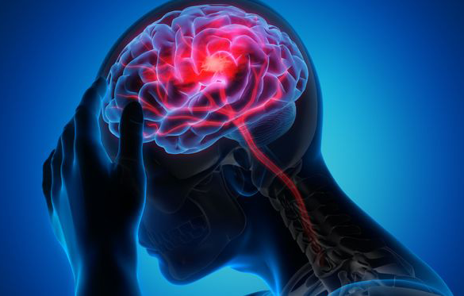
Gambar 1. Stroke - [Image Reference](http://ners.unair.ac.id/site/index.php/news-fkp-unair/30-lihat/1044-stroke-dan-gaya-hidup)

Pentingnya memprediksi risiko stroke juga dapat dilihat dari data-data konkret. Misalnya, dalam konteks internasional, Stroke menyerang sekitar 15 juta orang per tahun [4], dan dampaknya tidak hanya terbatas pada tingkat kematian. Banyak yang selamat dari stroke mengalami kecacatan jangka panjang, memerlukan perawatan intensif, dan mengalami penurunan kualitas hidup yang signifikan. Oleh karena itu, upaya preventif menjadi krusial untuk mengurangi beban sosial dan ekonomi yang ditimbulkan oleh stroke.

Dalam upaya meningkatkan pemahaman dan pencegahan terhadap stroke, sebuah proyek penelitian akan dilakukan untuk mengembangkan model machine learning yang dapat memprediksi risiko stroke pada individu. Proyek ini akan melibatkan analisis berbagai faktor kesehatan, seperti tekanan darah, kadar gula darah, indeks massa tubuh (BMI), riwayat merokok, dan faktor risiko lainnya yang dapat mempengaruhi kemungkinan seseorang mengalami stroke. Dimana variabel-variabel tersebut didukung oleh data, yang mengatakan bahwa penyebab stroke dapat diakibatkan oleh tekanan darah, kurangnya aktivitas fisik, konsumsi makanan, kebiasaan merokok, dan faktor-faktor lainnya [3].

Dengan memanfaatkan data kesehatan dan riwayat medis, model ini diharapkan dapat memberikan prediksi akurat tentang risiko stroke pada seseorang. Implementasi proyek ini dapat membantu para profesional medis dalam memberikan peringatan dini kepada pasien dengan risiko tinggi, sehingga tindakan pencegahan dapat diambil lebih awal. Selain itu, model ini dapat menjadi alat yang berguna bagi masyarakat dalam memahami dan mengelola faktor risiko kesehatan mereka, serta mendukung kebijakan kesehatan masyarakat yang lebih proaktif dalam pencegahan stroke.

## Business Understanding

Proyek ini dibangun untuk membantu para profesional medis dalam memberikan peringatan dini kepada pasien dengan risiko tinggi, sehingga tindakan pencegahan dapat diambil lebih awal. Selain itu, model ini dapat menjadi alat yang berguna bagi masyarakat dalam memahami dan mengelola faktor risiko kesehatan mereka, serta mendukung kebijakan kesehatan masyarakat yang lebih proaktif dalam pencegahan stroke.

### Problem Statements

- Bagaimana mengidentifikasi faktor-faktor risiko yang berkontribusi pada kemungkinan seseorang terkena stroke?
- Bagaimana membangun model prediktif untuk memprediksi risiko seseorang terkena stroke berdasarkan faktor-faktor tertentu?
- Bagaimana menentukan dampak variabel-variabel tertentu terhadap prediksi risiko stroke?

### Goals

- Menganalisis faktor-faktor risiko yang berkontribusi pada kemungkinan seseorang terkena stroke.
- Mengembangkan model machine learning untuk memprediksi risiko stroke berdasarkan variabel-variabel tertentu.
- Menyajikan hasil analisis dan model secara jelas dan terukur untuk mendukung pengambilan keputusan.

Kriteria/Ukuran Hasil Analisis yang Terukur:
- Menyajikan temuan analisis dengan tingkat kejelasan yang tinggi, disertai dengan visualisasi yang mendukung.
- Model machine learning memiliki tingkat akurasi dan kehandalan yang dapat diukur.

Metrik Khusus untuk Evaluasi Keberhasilan:
- Akurasi model prediktif sebagai indikator seberapa baik model dapat memprediksi kasus positif dan negatif.
- Presisi sebagai metrik untuk mengukur seberapa banyak prediksi positif yang benar-benar relevan.
- Recall untuk menilai kemampuan model mengidentifikasi sebanyak mungkin kasus positif.
- F1-score sebagai keseimbangan antara presisi dan recall.

### Solution statements
- Menyiapkan data agar dapat digunakan untuk proses analisis dan pemodelan machine learning.
- Melakukan eksplorasi data untuk memahami hubungan antar variabel dan melihat tren dalam dataset.
- Melakukan feature engineering (Standarisasi, *One-hot-encoding*) untuk meningkatkan kinerja model.
- Membangun model prediktif menggunakan algoritma klasifikasi seperti *K-Nearest Neighbors*, *Random Forest* dan *Adaptive Boosting*.
- Melakukan evaluasi model menggunakan metrik evaluasi yang relevan seperti akurasi, presisi, *recall*, dan *F1-score*. Memilih model terbaik berdasarkan performa evaluasi.
- Melakukan *hyperparameter tuning* menggunakan *grid search* untuk meningkatkan performa model.

Kontribusi Model dalam Kesehatan Masyarakat:
- Penyadaran Risiko Stroke: Model ini dapat memberikan informasi kepada masyarakat tentang faktor risiko stroke yang perlu diwaspadai. Dengan pemahaman ini, individu dapat mengambil langkah-langkah preventif yang lebih baik.
- Pengelolaan Faktor Risiko Kesehatan: Melalui hasil prediksi model, masyarakat dapat mengelola faktor risiko kesehatan mereka secara lebih efektif. Misalnya, dengan menyesuaikan pola makan, meningkatkan aktivitas fisik, atau mengontrol tekanan darah, mereka dapat mengurangi risiko stroke.
- Dukungan Kebijakan Kesehatan Masyarakat: Model ini dapat menjadi dasar bagi kebijakan kesehatan masyarakat yang lebih proaktif dalam pencegahan stroke. Dengan menargetkan populasi dengan risiko tinggi, pihak berwenang dapat mengimplementasikan intervensi yang lebih efisien dan efektif.
- Peran Edukasi dan Kesadaran: Model ini dapat digunakan sebagai alat edukasi untuk meningkatkan kesadaran masyarakat tentang pentingnya deteksi dini dan pencegahan stroke. Ini dapat menciptakan budaya kesehatan yang lebih baik di masyarakat.

## Data Understanding
Dataset yang digunakan adalah dataset yang diambil dari [Kaggle](https://www.kaggle.com/fedesoriano/stroke-prediction-dataset). Dataset ini merupakan data kesehatan yang berisi informasi tentang kondisi kesehatan dan riwayat medis dari pasien yang berpotensi mengalami stroke.

Berikut informasi dari dataset :
- Dataset memiliki format CSV (*Comma-Seperated Values*).
- Dataset memiliki 5110 baris dan 12 kolom.
- Dataset memiliki 4 kolom bertipe numerik dan 8 kolom bertipe kategorikal.
- Dataset memiliki 201 baris data yang memiliki nilai null pada kolom BMI.

### Variabel-variabel pada Restaurant UCI dataset adalah sebagai berikut:
- `id`: ID unik untuk setiap data
- `gender`: Jenis kelamin pasien
- `age`: Usia pasien
- `hypertension`: Pasien menderita hipertensi atau tidak
- `heart_disease`: Pasien menderita penyakit jantung atau tidak
- `ever_married`: Pasien pernah menikah atau tidak
- `work_type`: Tipe pekerjaan pasien
- `Residence_type`: Tipe tempat tinggal pasien
- `avg_glucose_level`: Rata-rata kadar glukosa pasien dalam satuan mg/dL
- `bmi`: Indeks massa tubuh pasien
- `smoking_status`: Status merokok pasien
- `stroke`: Pasien mengalami stroke atau tidak

### Eksplorasi Data
#### Informasi Data

Tabel 1. Informasi data

| #   | Kolom             | Non-Null Count | Dtype   |
| --- | ----------------- | -------------- | ------- |
| 0   | id                | 5110 non-null  | int64   |
| 1   | gender            | 5110 non-null  | object  |
| 2   | age               | 5110 non-null  | float64 |
| 3   | hypertension      | 5110 non-null  | int64   |
| 4   | heart_disease     | 5110 non-null  | int64   |
| 5   | ever_married      | 5110 non-null  | object  |
| 6   | work_type         | 5110 non-null  | object  |
| 7   | Residence_type    | 5110 non-null  | object  |
| 8   | avg_glucose_level | 5110 non-null  | float64 |
| 9   | bmi               | 4909 non-null  | float64 |
| 10  | smoking_status    | 5110 non-null  | object  |
| 11  | stroke            | 5110 non-null  | int64   |

#### Deskripsi Data

Table 2. Deskripsi data

|       | id           | age         | hypertension | heart_disease | avg_glucose_level | bmi         | stroke      |
| ----- | ------------ | ----------- | ------------ | ------------- | ----------------- | ----------- | ----------- |
| count | 5110.000000  | 5110.000000 | 5110.000000  | 5110.000000   | 5110.000000       | 4909.000000 | 5110.000000 |
| mean  | 36517.829354 | 43.226614   | 0.097456     | 0.054012      | 106.147677        | 28.893237   | 0.048728    |
| std   | 21161.721625 | 22.612647   | 0.296607     | 0.226063      | 45.283560         | 7.854067    | 0.215320    |
| min   | 67.000000    | 0.080000    | 0.000000     | 0.000000      | 55.120000         | 10.300000   | 0.000000    |
| 25%   | 17741.250000 | 25.000000   | 0.000000     | 0.000000      | 77.245000         | 23.500000   | 0.000000    |
| 50%   | 36932.000000 | 45.000000   | 0.000000     | 0.000000      | 91.885000         | 28.100000   | 0.000000    |
| 75%   | 54682.000000 | 61.000000   | 0.000000     | 0.000000      | 114.090000        | 33.100000   | 0.000000    |
| max   | 72940.000000 | 82.000000   | 1.000000     | 1.000000      | 271.740000        | 97.600000   | 1.000000    |

Dari informasi data diatas, dapat dilihat bahwa kolom `id` tidak mempengaruhi proses analisis dan pemodelan, karena hanya sebagai index saja. Oleh karena itu, kolom `id` akan dihapus dari dataset.

#### Univariate Analysis
- Fitur Kategorikal

  Berikut beberapa grafik yang menunjukkan distribusi data pada fitur kategorikal.
  - Fitur `gender`

    Tabel 3. Distribusi fitur `gender`

    | gender | jumlah sampel | persentase |
    | ------ | ------------- | ---------- |
    | Female | 2994          | 58.6%      |
    | Male   | 2115          | 41.4%      |
    | Other  | 1             | 0.0%       |

    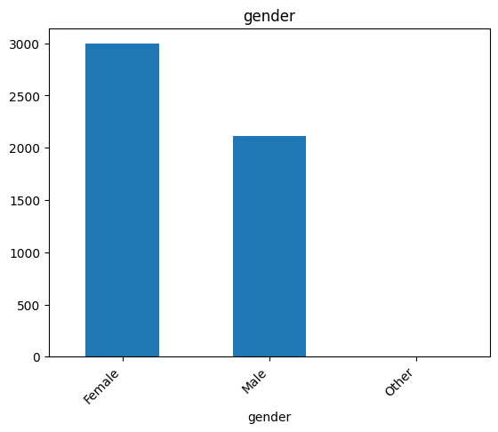

    Gambar 2. Distribusi fitur `gender`

    Dari grafik pada gambar 2 diatas, dapat dilihat bahwa jumlah pasien perempuan lebih banyak daripada pasien laki-laki. Selain itu, terdapat gender yang tidak diketahui, sehingga akan dihapus dari dataset.
  - Fitur `hypertension`

    Tabel 4. Distribusi fitur `hypertension`

    | hypertension | jumlah sampel | persentase |
    | ------------ | ------------- | ---------- |
    | 0            | 4612          | 90.3%      |
    | 1            | 498           | 9.7%       |

    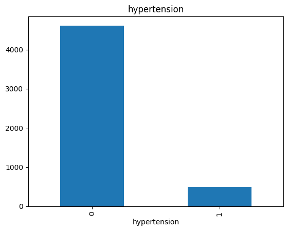

    Gambar 3. Distribusi fitur `hypertension`

    Dari grafik pada gambar 3 diatas, dapat dilihat bahwa jumlah pasien yang tidak menderita hipertensi lebih banyak daripada pasien yang menderita hipertensi.

  - Fitur `heart_disease`

    Tabel 5. Distribusi fitur `heart_disease`

    | heart_disease | jumlah sampel | persentase |
    | ------------- | ------------- | ---------- |
    | 0             | 4834          | 94.6%      |
    | 1             | 276           | 5.4%       |

    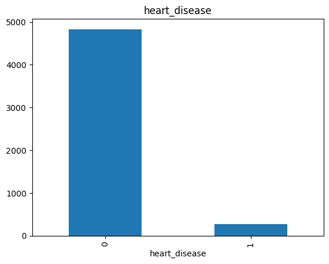

    Gambar 4. Distribusi fitur `heart_disease`

    Dari grafik pada gambar 4 diatas, dapat dilihat bahwa jumlah pasien yang tidak menderita penyakit jantung lebih banyak daripada pasien yang menderita penyakit jantung.

  - Fitur `ever_married`

    Table 6. Distribusi fitur `ever_married`

    | ever_married | jumlah sampel | persentase |
    | ------------ | ------------- | ---------- |
    | Yes          | 3353          | 65.6%      |
    | No           | 1757          | 34.4%      |

    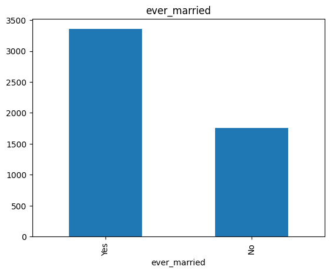

    Gambar 5. Distribusi fitur `ever_married`

    Dari grafik pada gambar 5 diatas, dapat dilihat bahwa jumlah pasien yang sudah menikah lebih banyak daripada pasien yang belum menikah.

  - Fitur `work_type`

    Tabel 7. Distribusi fitur `work_type`

    | work_type     | jumlah sampel | persentase |
    | ------------- | ------------- | ---------- |
    | Private       | 2925          | 57.2%      |
    | Self-employed | 819           | 16.0%      |
    | children      | 687           | 13.4%      |
    | Govt_job      | 657           | 12.9%      |
    | Never_worked  | 22            | 0.4%       |

    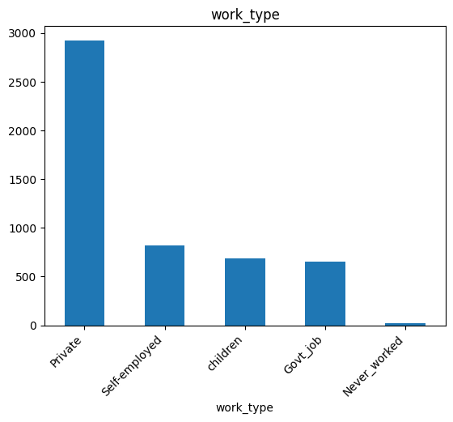

    Gambar 6. Distribusi fitur `work_type`

    Dari grafik pada gambar 6 diatas, dapat dilihat bahwa jumlah pasien yang bekerja sebagai private dan self-employed lebih banyak daripada pasien yang bekerja sebagai children, govt_job, dan never_worked.

  - Fitur `Residence_type`

    Tabel 8. Distribusi fitur `Residence_type`

    | Residence_type | jumlah sampel | persentase |
    | -------------- | ------------- | ---------- |
    | Urban          | 2596          | 50.8%      |
    | Rural          | 2514          | 49.2%      |

    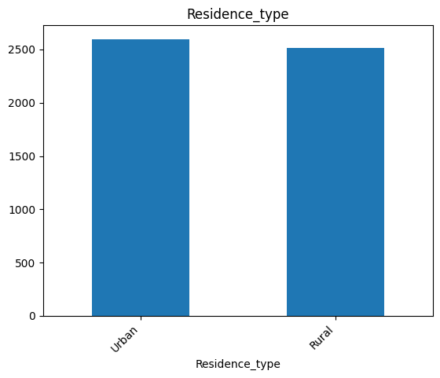

    Gambar 7. Distribusi fitur `Residence_type`

    Dari grafik pada gambar 7 diatas, dapat dilihat bahwa jumlah pasien yang tinggal di daerah urban (perkotaan) lebih banyak daripada pasien yang tinggal di daerah rural (pedesaan).

  - Fitur  `smoking_status`

    Tabel 9. Distribusi fitur `smoking_status`

    | smoking_status  | jumlah sampel | persentase |
    | --------------- | ------------- | ---------- |
    | never smoked    | 1892          | 37.0%      |
    | Unknown         | 1544          | 30.2%      |
    | formerly smoked | 885           | 17.3%      |
    | smokes          | 789           | 15.4%      |
  
    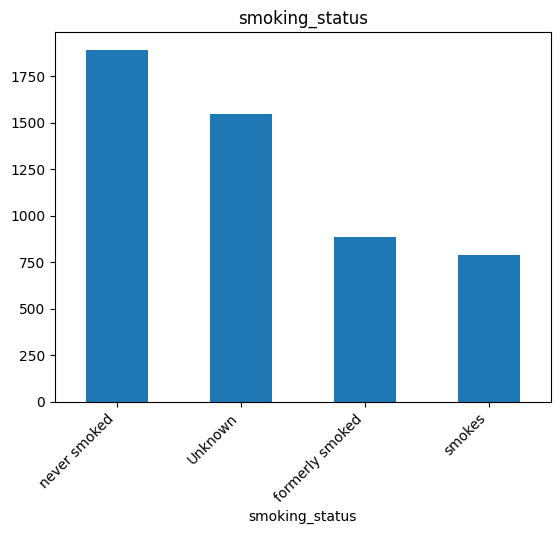

    Gambar 8. Distribusi fitur `smoking_status`

    Dari grafik pada gambar 8 diatas, dapat dilihat bahwa jumlah pasien yang tidak merokok lebih banyak dibandingkan dengan jumlah pasien yang merokok. Selain itu, terdapat pasien yang tidak diketahui status merokoknya, sehingga akan dihapus dari dataset. Selain itu, terdapat pasien yang pernah merokok, sehingga akan diubah menjadi pasien yang merokok.

  - Fitur `stroke`

    Tabel 10. Distribusi fitur `stroke`

    | stroke | jumlah sampel | persentase |
    | ------ | ------------- | ---------- |
    | 0      | 4861          | 95.1%      |
    | 1      | 249           | 4.9%       |

    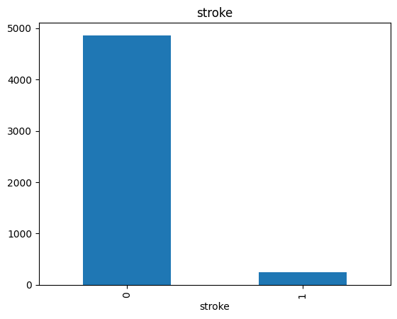

    Gambar 9. Distribusi fitur `stroke`

    Dari grafik pada gambar 9 diatas, dapat dilihat bahwa jumlah pasien yang tidak mengalami stroke lebih banyak daripada jumlah pasien yang mengalami stroke. Selain itu, dapat dilihat bahwa dataset memiliki distribusi yang tidak seimbang, yang ditunjukkan dengan jumlah pasien yang tidak mengalami stroke lebih banyak daripada jumlah pasien yang mengalami stroke. Sehingga perlu dilakukan oversampling untuk membuat distribusi data pada fitur stroke menjadi seimbang.

- Fitur Numerikal

  Berikut merupakan grafik yang menunjukkan distribusi data pada fitur numerikal.

  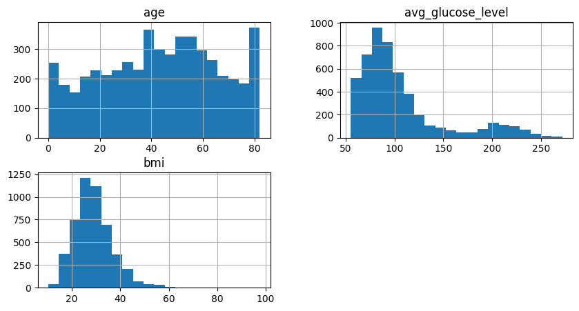

  Gambar 10. Distribusi fitur numerikal

  Dari grafik pada gambar 9 diatas, dapat dilihat bahwa:
  - Usia pasien memiliki distribusi yang normal.
  - Kadar glukosa pasien paling banyak berada pada rentang 50 sampai 125.
  - Indeks massa tubuh pasien paling banyak berada pada rentang 10 sampai 30.

#### Multivariate Analysis
- Fitur Kategorikal

  Berikut merupakan hubungan fitur-fitur kategorikal dengan kemungkinan seseorang mengalami stroke.

  - Fitur `gender`

    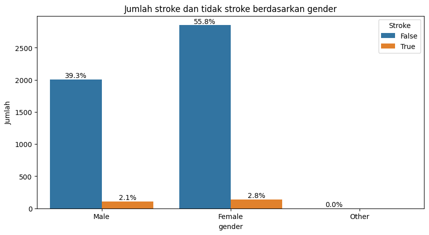

    Gambar 11. Grafik distribusi stroke berdasarkan fitur `gender`
    
    Dapat dilihat bahwa gender `Male` memiliki kemungkinan lebih besar untuk mengalami stroke, yang ditunjukkan dengan persentase jumlah stroke pada pasien laki-laki lebih besar yaitu sebesar :

    $$
    \frac{2.1}{2.1 + 39.3} \times 100\% = 5.1\%
    $$

     daripada persentase jumlah stroke pada pasien perempuan yang sebesar :

    $$

    \frac{2.8}{2.8 + 55.8} \times 100\% = 4.8\%
    $$

    Data diatas didukung pada data pada artikel [1], yang mengatakan bahwa pasien stroke lebih banyak didominasi oleh laki-laki daripada perempuan.

  - Fitur `hypertension`

    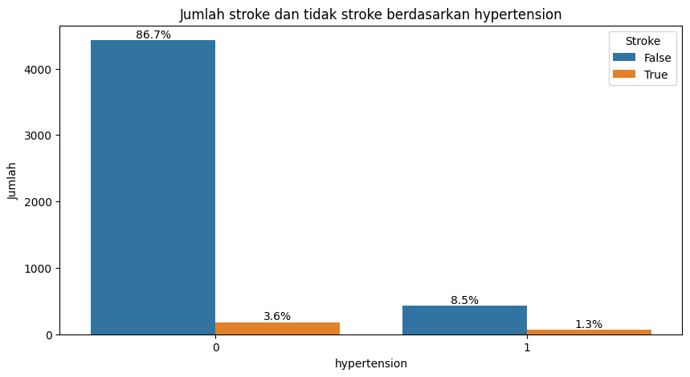

    Gambar 12. Grafik distribusi stroke berdasarkan fitur `hypertension`
    
    Dapat dilihat bahwa pasien yang menderita hipertensi memiliki kemungkinan lebih besar untuk mengalami stroke, yang ditunjukkan dengan persentase jumlah stroke pada pasien yang menderita hipertensi lebih besar yaitu sebesar :

    $$
    \frac{1.3}{1.3 + 8.5} \times 100\% = 13.3\%
    $$

    daripada persentase jumlah stroke pada pasien yang tidak menderita hipertensi yang sebesar :

    $$
    \frac{3.6}{3.6 + 86.7} \times 100\% = 4.0\%
    $$

  - Fitur `heart_disease`

    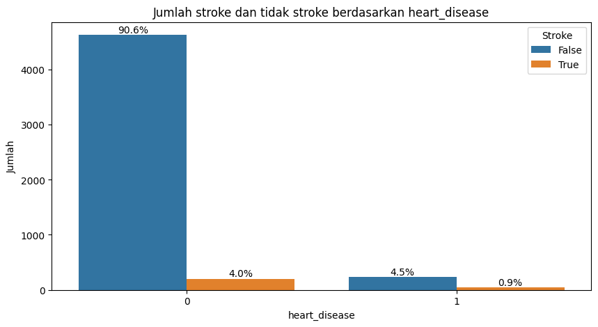

    Gambar 13. Grafik distribusi stroke berdasarkan fitur `heart_disease`
    
    Dapat dilihat bahwa pasien yang menderita penyakit jantung memiliki kemungkinan lebih besar untuk mengalami stroke, yang ditunjukkan dengan persentase jumlah stroke pada pasien yang menderita penyakit jantung lebih besar yaitu sebesar :

    $$
    \frac{0.9}{0.9 + 4.5} \times 100\% = 16.7\%
    $$

    daripada persentase jumlah stroke pada pasien yang tidak menderita penyakit jantung yang sebesar :

    $$
    \frac{4.0}{4.0 + 90.6} \times 100\% = 4.2\%
    $$

  - Fitur `ever_married`

    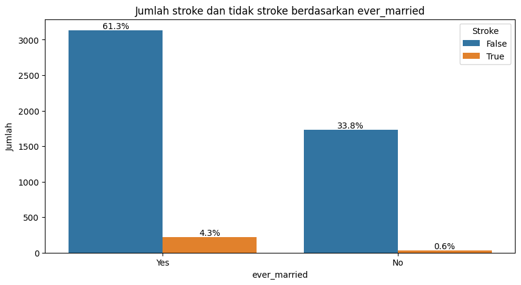

    Gambar 14. Grafik distribusi stroke berdasarkan fitur `ever_married`
    
    Dapat dilihat bahwa pasien yang sudah menikah memiliki kemungkinan lebih besar untuk mengalami stroke, yang ditunjukkan dengan persentase jumlah stroke pada pasien yang sudah menikah lebih besar yaitu sebesar :

    $$
    \frac{4.3}{4.3 + 61.3} \times 100\% = 6.5\%
    $$

    daripada persentase jumlah stroke pada pasien yang belum menikah yang sebesar :

    $$
    \frac{0.6}{0.6 + 33.8} \times 100\% = 1.7\%
    $$

  - Fitur `work_type`

    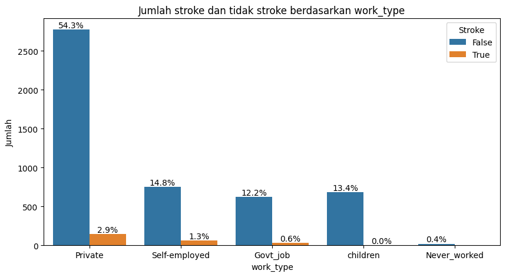

    Gambar 15. Grafik distribusi stroke berdasarkan fitur `work_type`
    
    Dapat dilihat bahwa pasien stroke memiliki kemungkinan lebih besar untuk bekerja sebagai self-employed dengan persentase jumlah stroke pada pasien yang bekerja sebagai self-employed paling besar yaitu sebesar :

    $$
    \frac{1.3}{1.3 + 14.8} \times 100\% = 8.1\%
    $$

  - Fitur `Residence_type`
  
    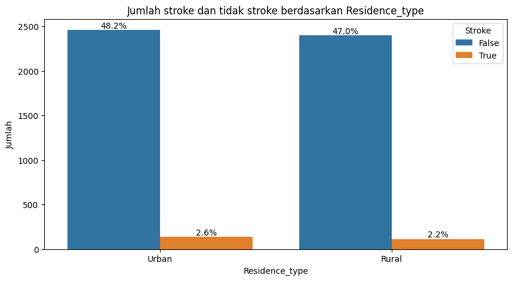

    Gambar 16. Grafik distribusi stroke berdasarkan `Residence_type`
    
    Dapat dilihat bahwa pasien stroke memiliki kemungkinan lebih besar untuk tinggal di daerah urban (perkotaan) dengan persentase:

    $$
    \frac{2.6}{2.8 + 48.2} \times 100\% = 5.1\%
    $$

    daripada persentase jumlah stroke pada pasien yang tinggal di daerah rural (pedesaan) yang sebesar :

    $$
    \frac{2.2}{2.2 + 47.0} \times 100\% = 4.5\%
    $$

    Data diatas didukung pada data pada artikel [2], yang mengatakan bahwa pasien stroke lebih banyak tinggal di daerah urban (perkotaan) daripada di daerah rural (pedesaan).

  - Fitur `smoking_status`

    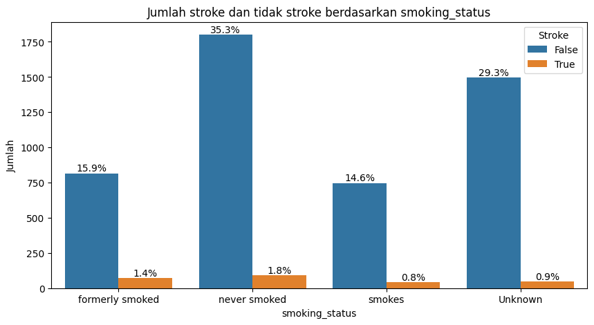

    Gambar 17. Grafik distribusi stroke berdasarkan fitur `smoking_status`
    
    Dapat dilihat bahwa merokok memiliki kemungkinan lebih besar untuk mengalami stroke, yang ditunjukkan dengan persentase jumlah stroke pada pasien yang pernah merokok lebih besar yaitu sebesar :

    $$
    \frac{1.4}{1.4 + 15.9} \times 100\% = 8.1\%
    $$

    lalu diikuti dengan persentase jumlah stroke pada pasien yang pernah merokok yang sebesar :

    $$
    \frac{0.8}{0.8 + 14.6} \times 100\% = 5.2\%
    $$
   
- Fitur Numerikal

  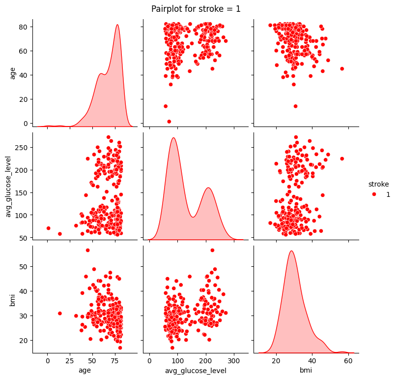

  Gambar 18. Grafik distribusi pasien stroke berdasarkan fitur numerikal

  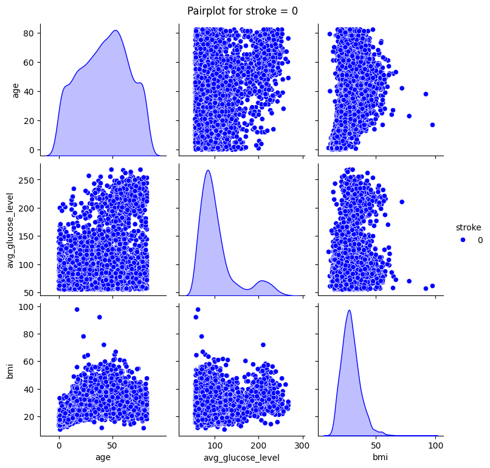

  Gambar 19. Grafik distribusi pasien tidak stroke berdasarkan fitur numerikal

  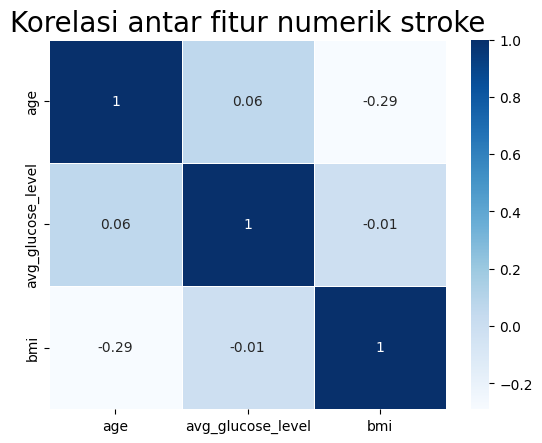

  Gambar 20. Grafik kolerasi antar fitur numerikal untuk pasien stroke

  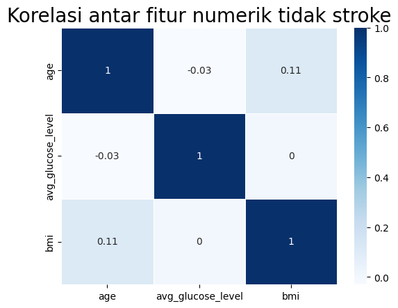

  Gambar 21. Grafik kolerasi antar fitur numerikal untuk pasien tidak stroke

  Pada grafik diatas dapat dilihat bahwa pasien stroke terjadi paling banyak pada: 
  - Usia 40 keatas
  - Kadar glukosa diluar kadar glukosa normal (sekita 160 mg/dL) []5
  - Indeks massa tubuh 20 sampai 50

## Data Preparation

- *Drop Column*

  Kolom `id` akan dihapus dari *dataset* karena hanya sebagai indeks saja.

- *Missing Value*

  Tabel 11. Jumlah *missing valu*e pada *dataset*

  | kolom             | jumlah missing value |
  | ----------------- | -------------------- |
  | gender            | 0                    |
  | age               | 0                    |
  | hypertension      | 0                    |
  | heart_disease     | 0                    |
  | ever_married      | 0                    |
  | work_type         | 0                    |
  | Residence_type    | 0                    |
  | avg_glucose_level | 0                    |
  | bmi               | 201                  |
  | smoking_status    | 0                    |
  | stroke            | 0                    |

  Pada kolom `bmi` terdapat 201 baris data yang memiliki nilai *null*. Untuk mengatasi hal ini, nilai *null* akan dihapus dari *dataset*.

- *Outlier*
  
  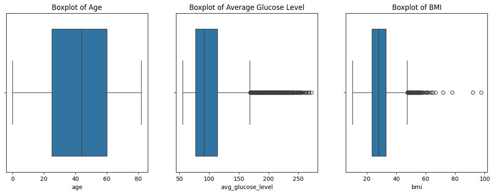

  Gambar 22. Boxplot fitur numerikal

  Dari *boxplot* diatas, dapat dilihat bahwa kolom `avg_glucose_level` dan `bmi` memiliki *outlier*. Untuk mengatasi hal ini, *outlier* akan dihapus dari dataset.

- Imputation
  Beberapa fitur yang diubah :
  - Mengubah nilai `Other` pada kolom `gender` menjadi `Female`
  - Menghapus data yang bernilai `Unknown` pada kolom `smoking_status`
  - Mengubah nilai `formerly smoked` pada kolom `smoking_status` menjadi `smokes`

- *One-Hot Encoding*
  
  Pada dataset terdapat beberapa fitur yang memiliki tipe data kategorikal, sehingga perlu dilakukan *one-hot encoding* untuk mengubah fitur-fitur tersebut menjadi numerikal. One-hot encoding sendiri merupakan proses mengubah fitur kategorikal menjadi vektor biner yang dapat digunakan oleh algoritma machine learning untuk melakukan prediksi. Fitur-fitur yang akan dilakukan one-hot encoding adalah `gender`, `hypertension`, `heart_disease`, `ever_married`, `work_type`, `residence_type`, dan `smoking_status`.

- *Train Test Split*

  Dataset akan dibagi menjadi 2 bagian, yaitu data training dan data testing. Data training akan digunakan untuk melatih model, sedangkan data testing akan digunakan untuk menguji performa model. Data training akan memiliki proporsi 80% dari total data, sedangkan data testing akan memiliki proporsi 20% dari total data.

- *Oversampling*

  Pada dataset, distribusi data pada fitur `stroke` tidak seimbang, yang ditunjukkan dengan jumlah data yang tidak stroke lebih banyak daripada jumlah data yang stroke. Oleh karena itu, perlu dilakukan oversampling untuk membuat distribusi data pada fitur `stroke` menjadi seimbang. *Oversampling* sendiri merupakan proses menambahkan data pada kelas minoritas sehingga jumlah data pada kelas minoritas menjadi sama dengan jumlah data pada kelas mayoritas. Pada proyek ini, *oversampling* akan dilakukan menggunakan metode SMOTE (*Synthetic Minority Oversampling Technique*).

- Standarisasi

  Pada *dataset* terdapat beberapa fitur yang memiliki skala yang berbeda, sehingga perlu dilakukan standarisasi untuk mengubah skala fitur-fitur tersebut menjadi sama. Standarisasi sendiri merupakan proses mengubah fitur numerikal menjadi memiliki nilai rata-rata 0 dan standar deviasi 1. Fitur-fitur yang akan dilakukan standarisasi adalah `age`, `avg_glucose_level`, dan `bmi`.

## Modeling
- Algoritma *Machine Learning*

  Pada proyek ini, akan digunakan 3 algoritma klasifikasi, yaitu *K-Nearest Neighbors*, *Random Forest*, dan *Adaptive Boosting*, dimana algrotima-algoritma ini digunakan karena memiliki performa yang baik dalam melakukan klasifikasi [5].
  
  Ketiga algoritma ini akan dibandingkan performanya untuk menentukan algoritma mana yang paling cocok untuk memprediksi risiko stroke pada individu.
  - **Algoritma K-Nearest Neighbors (KNN)** adalah metode sederhana yang menggunakan kesamaan fitur untuk memprediksi nilai data baru. Dalam konteks regresi, KNN memilih sejumlah k tetangga terdekat dan menghitung rata-rata nilai target mereka sebagai prediksi. Parameter yang digunakan pada algoritma ini adalah: 
    - `n_neighbors` : Jumlah tetangga terdekat yang akan digunakan untuk melakukan prediksi.
    - `weights`: Menentukan bobot yang akan digunakan dalam prediksi. Bobot yang tersedia adalah `uniform` dan `distance`. Jika menggunakan `uniform`, maka semua tetangga akan memiliki bobot yang sama. Jika menggunakan `distance`, maka tetangga yang lebih dekat akan memiliki bobot yang lebih besar.
    - `leaf_size`: Menentukan ukuran *leaf tree* yang akan digunakan. Semakin besar nilai `leaf size`, maka semakin cepat proses prediksi, namun semakin besar pula penggunaan memori.
    - `p` : Menentukan metrik jarak yang akan digunakan. Metrik jarak yang tersedia adalah `1` (Manhattan *Distance*) dan `2` (Euclidean *Distance*).
  - **Algoritma Random Forest** adalah model machine learning dalam kategori *ensemble learning*, yang terdiri dari beberapa model (pohon keputusan) yang bekerja bersama untuk menyelesaikan masalah klasifikasi atau regresi. Model ensemble bekerja dengan menggabungkan prediksi dari setiap model individual untuk menghasilkan prediksi akhir. Beberapa parameter yang digunkan, yaitu: 
    - `n_estimators` : Jumlah pohon keputusan yang akan digunakan.
    - `max_depth` : Maksimal kedalaman pohon keputusan yang akan digunakan.
    - `min_samples_split` : Jumlah minimum sampel yang dibutuhkan untuk membagi *node*. Jika jumlah sampel pada node kurang dari `min_samples_split`, maka *node* tersebut tidak akan dibagi.
    - `min_samples_leaf` : Jumlah minimum sampel yang dibutuhkan untuk menjadi *leaf node*. Jika jumlah sampel pada node kurang dari `min_samples_leaf`, maka node tersebut tidak akan menjadi *leaf node*.
  - **Algoritma Adaptive Boosting (AdaBoost)** adalah algoritma *ensemble learning* yang digunakan dalam klasifikasi. Algoritma ini menggabungkan beberapa model machine learning sederhana untuk membuat prediksi yang lebih akurat. Beberapa parameter yang digunakan, yaitu:
    - `n_estimators` : Jumlah model yang akan digunakan.
    - `learning_rate` : Menentukan seberapa besar bobot yang akan diberikan pada model berikutnya. Semakin besar *learning rate*, maka semakin besar pula bobot yang diberikan pada model berikutnya.

- *Hyperparameter Tuning* (*Grid Search*)

  Pada proyek ini, akan dilakukan *hyperparameter tuning* menggunakan *grid search* untuk meningkatkan performa model. Hyperparameter tuning sendiri merupakan proses mencari kombinasi hyperparameter terbaik untuk meningkatkan performa model. Berikut adalah nilai yang akan digunakan untuk hyperparameter tuning:

  | Model               | *Hyperparameter* yang akan di-*tuning* | Nilai yang akan digunakan |
  | ------------------- | -------------------------------------- | ------------------------- |
  | K-Nearest Neighbors | n_neighbors                            | 5, 10, 15, 20, 25, 30     |
  |                     | weights                                | uniform, distance         |
  |                     | leaf_size                              | 10, 20, 30, 40, 50        |
  |                     | p                                      | 1, 2                      |
  | Random Forest       | n_estimators                           | 100, 200, 300, 400, 500   |
  |                     | max_depth                              | 5, 10, 15, 20, 25, 30     |
  |                     | min_samples_split                      | 2, 5, 10                  |
  |                     | min_samples_leaf                       | 1, 2, 4                   |
  | Adaptive Boosting   | n_estimators                           | 100, 200, 300, 400, 500   |
  |                     | learning_rate                          | 0.01, 0.05, 0.1, 0.3, 1   |
  
  dimana, nilai yang akan digunakan untuk hyperparameter tuning didapatkan dari nilai-nilai yang biasa digunakan pada algoritma tersebut.
  
  *Hyperparameter tuning* akan dilakukan pada ketiga algoritma yang digunakan, yaitu *K-Nearest Neighbors*, *Random Forest*, dan *Adaptive Boosting*. Berikut adalah hasil dari *hyperparameter tuning* yang dilakukan:

  Tabel 12. Hasil *hyperparameter tuning*

  | Model               | *Best Parameters*                                                                     | Best Score         |
  | ------------------- | ------------------------------------------------------------------------------------- | ------------------ |
  | K-Nearest Neighbors | {'leaf_size': 10, 'n_neighbors': 5, 'p': 1, 'weights': 'distance'}                    | 0.9739819004524886 |
  | Random Forest       | {'max_depth': 30, 'min_samples_leaf': 1, 'min_samples_split': 5, 'n_estimators': 400} | 0.978733031674208  |
  | Adaptive Boosting   | {'learning_rate': 0.3, 'n_estimators': 400}                                           | 0.9678733031674207 |

  Dari tabel diatas, dapat dilihat bahwa dari ketiga algoritma yang digunakan, algoritma *Radom Forest* memiliki skor yang paling baik, dengan nilai  0.978733031674208.

## Evaluation

Metrik evaluasi yang digunakan pada proyek ini adalah akurasi, *precision*, *recall*, dan *F1-score*. Metrik evaluasi ini dipilih karena dapat digunakan untuk mengevaluasi performa model klasifikasi.

$$
\text{Accuracy} = \frac{\text{TP} + \text{TN}}{\text{TP} + \text{TN} + \text{FP} + \text{FN}}
$$

$$
\text{Precision} = \frac{\text{TP}}{\text{TP} + \text{FP}}
$$

$$
\text{Recall} = \frac{\text{TP}}{\text{TP} + \text{FN}}
$$

$$
\text{F1-score} = 2 \times \frac{\text{Precision} \times \text{Recall}}{\text{Precision} + \text{Recall}}
$$

- Akurasi: Akurasi merupakan rasio prediksi yang benar dengan total data yang diprediksi. Akurasi dapat digunakan untuk mengevaluasi performa model klasifikasi jika *dataset* memiliki distribusi yang sama untuk setiap kelasnya. Namun, jika *dataset* memiliki distribusi yang tidak sama untuk setiap kelasnya, maka akurasi tidak dapat digunakan untuk mengevaluasi performa model klasifikasi.
- *Precision*: *Precision* merupakan rasio prediksi yang benar dengan total data yang diprediksi positif. *Precision* dapat digunakan untuk mengevaluasi performa model klasifikasi jika terdapat biaya yang tinggi untuk mendeteksi data negatif sebagai positif.
- *Recall*: *Recall* merupakan rasio prediksi yang benar dengan total data yang sebenarnya positif. *Recall* dapat digunakan untuk mengevaluasi performa model klasifikasi jika terdapat biaya yang tinggi untuk mendeteksi data positif sebagai negatif.
- *F1-score*: *F1-score* merupakan rata-rata harmonik dari precision dan *recall*. *F1-score* dapat digunakan untuk mengevaluasi performa model klasifikasi jika terdapat biaya yang tinggi untuk mendeteksi data positif sebagai negatif dan mendeteksi data negatif sebagai positif.

Karena pada dataset distribusi negatif (tidak stroke) lebih banyak daripada distribusi positif (stroke), dan model diprioritaskan untuk mendeteksi data positif, maka metrik evaluasi yang digunakan adalah metrik recall dengan nilai yang tinggi dan metrik *f1-score* dengan nilai yang seimbang.

Berikut adalah hasil evaluasi dari ketiga algoritma yang digunakan:
- Akurasi

  Tabel 13. Hasil evaluasi akurasi

  |              | train    | test     |
  | ------------ | -------- | -------- |
  | KNN          | 1.0      | 0.942708 |
  | RandomForest | 1.0      | 0.961806 |
  | Boosting     | 0.974874 | 0.949653 |

- *Precision*

  Tabel 14. Hasil evaluasi *precision*

  |              | train    | test  |
  | ------------ | -------- | ----- |
  | KNN          | 1.0      | 0.125 |
  | RandomForest | 1.0      | 0.0   |
  | Boosting     | 0.990539 | 0.0   |

- *Recall*

  Tabel 15. Hasil evaluasi *recall*

  |              | train    | test     |
  | ------------ | -------- | -------- |
  | KNN          | 1.0      | 0.095238 |
  | RandomForest | 0.986878 | 0.0      |
  | Boosting     | 0.947511 | 0.0      |

- *F1-score*

  Table 16. Hasil evaluasi *f1-score*

  |              | train    | test     |
  | ------------ | -------- | -------- |
  | KNN          | 1.0      | 0.108108 |
  | RandomForest | 0.993396 | 0.0      |
  | Boosting     | 0.968548 | 0.0      |

- *Confusion Matrix*

  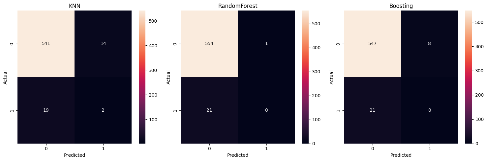

  Gambar 23. *Confusion matrix* untuk ketiga model

Dari nilai diatas, maka dapat disimpulkan bahwa ketiga model mampu memprediksi dengan baik untuk data negatif (tidak stroke), namun kurang baik untuk data positif (stroke). Namun, karena model diprioritaskan untuk mendeteksi data positif sebagai metode pencegahan risiko stroke, maka model yang dipilih adalah model dengan nilai *recall* pada data testing paling tinggi, yaitu model *K-Nearest Neighbors*. Selain itu, model *K-Nearest Neighbors* juga dapat memprediksi data positif dengan lebih baik daripada model *Random Forest* dan *Adaptive Boosting*, yang ditunjukkan dari *confusion matrix* pada gambar 23 diatas.

Namun, perlu diingat bahwa prediksi yang dilakukan oleh model in hanya dilakukan untuk keperluan pencegahan risiko stroke, sehingga model ini tidak dapat digunakan untuk diagnosis stroke pada pasien.

## References
1.  Tombeng, J. A., Mahama, C. N., & Kembuan, M. A. H. M. (2020). Profil Kejang Pasca Stroke pada Pasien Rawat Inap Periode Juli 2018 - Juni 2019 di RSUP Prof. Dr. R. D. Kandou Manado. Medical Scope Journal, 1(2). https://doi.org/10.35790/msj.1.2.2020.27461
2.  Venketasubramanian, N., Yudiarto, F. L., & Tugasworo, D. (2022). Stroke Burden and Stroke Services in Indonesia. Cerebrovascular Diseases Extra, 12(1). https://doi.org/10.1159/000524161
3.  Sari, I. (2022). Analisis Ekologi: Hubungan Faktor Risiko dengan Prevalensi Stroke di Indonesia 2018. ARTERI : Jurnal Ilmu Kesehatan, 3(4). https://doi.org/10.37148/arteri.v3i4.236
4.  Tejada Meza, H., Artal Roy, J., Pérez Lázaro, C., Bestué Cardiel, M., Alberti González, O., Tejero Juste, C., Hernando Quintana, N., Jarauta Lahoz, L., Giménez Muñoz, A., Campello Morer, I., Fernández Sanz, A., Cruz Velásquez, G., Latorre Jiménez, A., Vinueza Buitrón, P., Crespo Burillo, J. A., Palacín Larroy, M., Millán García, J. R., Muñoz Farjas, E., Oliván Usieto, J. A., … Marta Moreno, J. (2022). Epidemiology and characteristics of ischaemic stroke in young adults in Aragon. Neurologia, 37(6). https://doi.org/10.1016/j.nrl.2019.05.008
5.  Sofizadeh, S., Pehrsson, A., Ólafsdóttir, A. F., & Lind, M. (2022). Evaluation of Reference Metrics for Continuous Glucose Monitoring in Persons Without Diabetes and Prediabetes. Journal of Diabetes Science and Technology, 16(2). https://doi.org/10.1177/1932296820965599
6.  al Mudawi, N., & Alazeb, A. (2022). A Model for Predicting Cervical Cancer Using Machine Learning Algorithms. Sensors, 22(11). https://doi.org/10.3390/s22114132